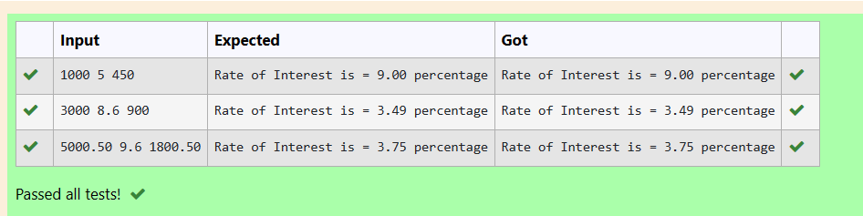
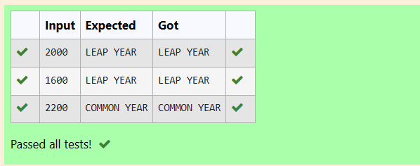

# EX1(C) OPERATORS AND EXPRESSIONS
Developed by: ARSHITHA MS

Register number: 212223240015
 ## AIM:
 To write a program to find rate of interest and to check if the given year is leap year.
 ## ALGORITHM:
 1.Start the program

 2.Declare the variables

 3.Get input from the user.

 4.Use the required formula to find the rate of interest.
 
 5.Similarly Use if-else statements to check if the year is leap year.

 6.Print the output.
 ## PROGRAM
 ### Program 1:
 ```
#include <stdio.h>
int main()
{
    float p,n,si,r;
    scanf("%f",&p);
    scanf("%f",&n);
    scanf("%f",&si);
    r = (si * 100) / (p * n);
    printf("Rate of Interest is = %.2f percentage",r);
    return 0;
}
```
### Program 2:
```
#include <stdio.h>
int main()
{
    int year;
    scanf("%d",&year);
    if (year%100==0)
    {
        if(year%400==0)
        {
            printf("LEAP YEAR");
        }
        else
        {
            printf("COMMON YEAR");
        }
    }
    else
    {
        if (year%4==0)
        {
            printf("LEAP YEAR");
        }
        else
        {
          printf("COMMON YEAR");  
        }
    }
    return 0;
}
```

## OUTPUT:
### Output 1:



### Output 2:

## RESULT:
Thus the program to find rate of interest and to check if the given year is leap year is executed successfully.